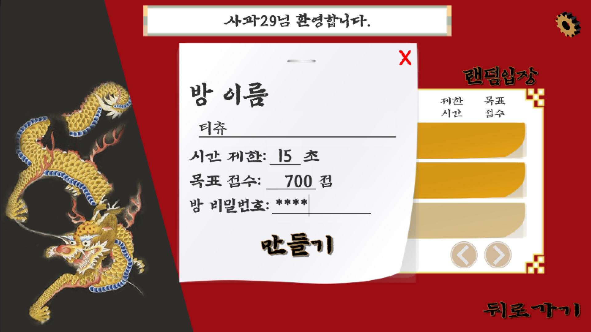

# Tichu

|제목|내용|
|:---:|:---:|
|기간|2022.06.26 ~ 2022.08.31|
|인원|1|
|역할|모든 작업|
|주제|두 명씩 팀을 이루어 정해진 족보에 맞는 카드를 사용하여 승리를 쟁취하는 전략게임|

## 인트로 화면

## 게임 룰

## 로비 - 방 생성 및 조회

## 대기실 - 준비 및 시작

## 게임 시작 인트로 화면

## 플레이
### 라지티츄

### 카드 분배

### 족보

### 특수카드
#### 현무
시작카드
스트레이트 시, 1로 사용될 수 있다.
소원을 통해 다음 차례의 상대의 카드를 강제 추출할 수 있다.

#### 백호
건너편의 우리팀에게 차례를 넘겨준다.
우리팀이 끝났을 경우, 우리팀 다음 차례의 적팀이 차례를 가진다.

#### 주작
족보에 맞는 어떤 카드로든 사용이 가능하다.
싱글로 사용할 경우, 테이블의 카드에 +0.5점을 취한다.

#### 청룡
싱글 카드 중 최강!

